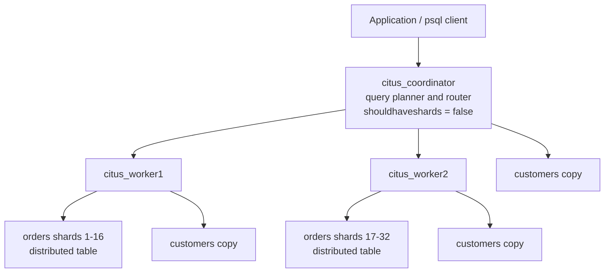

# Azure Cosmos DB for PostgreSQL (Citus) Locally in WSL

**Author:** Clement
**Environment:** WSL2 + Docker
**Goal:** Understand how Azure Cosmos DB for PostgreSQL (Hyperscale, Citus-based) differs from vanilla community PostgreSQL, by building a real 3-node Citus cluster locally and observing its behavior firsthand.

---

## Why this PoC

Azure Cosmos DB for PostgreSQL is Microsoft's managed offering built on **Citus** — a PostgreSQL extension that distributes tables across multiple physical Postgres nodes (a coordinator + workers), instead of running as a single instance like vanilla PostgreSQL. This PoC builds that architecture locally in Docker/WSL to observe, firsthand, how storage and query execution actually differ from a normal Postgres instance.

---

## Architecture simulated



- **Coordinator** — receives the query from the client, decides which shard(s) to hit, and combines results. Holds no `orders` data itself in this setup (`shouldhaveshards = false`).
- **Workers** — each holds half of the `orders` shards (16 of 32 apiece), plus its own full copy of the `customers` reference table.
- **Reference table (`customers`)** — replicated identically to every node, including the coordinator, regardless of `shouldhaveshards`.
- **Distributed table (`orders`)** — split into 32 shards total, spread only across the shard-eligible nodes (the two workers here), based on the distribution key `customer_id`.

---

## Who chooses Azure Cosmos DB for PostgreSQL, and why

Azure Cosmos DB for PostgreSQL exists for one specific problem: **a single Postgres instance has run out of room to grow**, either in write throughput, data volume, or both — and the workload has a natural way to split by a key (tenant ID, customer ID, account ID).

| Fits well | Doesn't fit / better served by vanilla Postgres or Cloud SQL |
|---|---|
| **Multi-tenant SaaS** — each tenant's data can shard cleanly by `tenant_id`, and tenants rarely need to join across each other | Single-tenant apps, or workloads with no natural distribution key |
| **Write-heavy workloads outgrowing one instance** — need to scale writes horizontally, not just reads | Read-heavy workloads — a read replica on vanilla Postgres often solves this more simply |
| **Large tables (100M+ rows) where a single node's disk/IO is the bottleneck** | Small-to-medium datasets that comfortably fit and perform on one instance |
| **Need to parallelize heavy analytical queries across a large dataset** (fan-out + coordinator merge, as seen in Step 7) | Complex ad-hoc joins across many unrelated tables — cross-shard joins are expensive unless co-located |
| **Teams already comfortable operating Postgres**, who want horizontal scaling without switching to a different database engine or query language | Teams wanting the simplest possible operational model — a sharded cluster is inherently more moving parts (multiple nodes, shard keys, co-location rules) than one managed instance |

**In short:** choose it when the real driver is *"one Postgres instance can't hold or serve this anymore, and the data has an obvious way to split."* If a workload doesn't have that clean split, or comfortably runs on a single well-sized instance, the added architectural complexity of sharding (as this PoC demonstrated — coordinator/worker roles, distribution-key-aware primary keys, per-database node registries, reference tables for lookups) isn't worth taking on, and a standard managed Postgres (like plain GCP Cloud SQL for PostgreSQL, the migration target here) is the simpler, more maintainable choice.

---

## Prerequisites

```bash
docker --version
docker compose version
```

WSL2 with Docker running, that's it.

---

## Step 1 — Project folder and docker-compose file

```bash
mkdir -p ~/citus-poc && cd ~/citus-poc

cat > docker-compose.yml << 'EOF'
version: '3'

services:
  coordinator:
    image: citusdata/citus:12.1
    container_name: citus_coordinator
    ports:
      - "5500:5432"
    environment:
      POSTGRES_PASSWORD: citus
    volumes:
      - coordinator_data:/var/lib/postgresql/data

  worker1:
    image: citusdata/citus:12.1
    container_name: citus_worker1
    environment:
      POSTGRES_PASSWORD: citus
    volumes:
      - worker1_data:/var/lib/postgresql/data

  worker2:
    image: citusdata/citus:12.1
    container_name: citus_worker2
    environment:
      POSTGRES_PASSWORD: citus
    volumes:
      - worker2_data:/var/lib/postgresql/data

volumes:
  coordinator_data:
  worker1_data:
  worker2_data:
EOF
```

## Step 2 — Bring the cluster up

```bash
docker compose up -d
docker ps
```

**Output:**
```
CONTAINER ID   IMAGE                  STATUS                    PORTS                                         NAMES
e87bfd3059f1   citusdata/citus:12.1   Up 52 seconds (healthy)   0.0.0.0:5500->5432/tcp, [::]:5500->5432/tcp   citus_coordinator
5fb6ff604cdb   citusdata/citus:12.1   Up 52 seconds (healthy)   5432/tcp                                      citus_worker1
e676e54b68e7   citusdata/citus:12.1   Up 52 seconds (healthy)   5432/tcp                                      citus_worker2
```
Three containers, all healthy — coordinator reachable on host port 5500, workers only reachable inside the Docker network.

---

## Step 3 — Create the shared database on every node

> **Understanding:** In Citus, a database is not automatically shared across the cluster. `CREATE DATABASE` on one node only creates it there — the same database + extension must exist on the coordinator **and** every worker before they can be wired together. This is different from vanilla Postgres, where there's only ever one instance to create a database on.

```bash
docker exec -it citus_coordinator psql -U postgres -c "CREATE DATABASE citus_poc;"
docker exec -it citus_coordinator psql -U postgres -d citus_poc -c "CREATE EXTENSION citus;"

docker exec -it citus_worker1 psql -U postgres -c "CREATE DATABASE citus_poc;"
docker exec -it citus_worker1 psql -U postgres -d citus_poc -c "CREATE EXTENSION citus;"

docker exec -it citus_worker2 psql -U postgres -c "CREATE DATABASE citus_poc;"
docker exec -it citus_worker2 psql -U postgres -d citus_poc -c "CREATE EXTENSION citus;"
```

---

## Step 4 — Wire the cluster together

> **Understanding:** Citus tracks cluster topology in a table called `pg_dist_node`, scoped **per-database** — this is the registry that says "these are my worker nodes." The coordinator also needs a network-reachable hostname registered for itself (`citus_set_coordinator_host`), because workers occasionally need to connect back to it for distributed transaction coordination. This whole concept of node registry + coordinator hostname has no equivalent in vanilla Postgres, since there's no cluster to register.

```bash
docker exec -it citus_coordinator psql -U postgres -d citus_poc -c \
  "SELECT citus_set_coordinator_host('citus_coordinator', 5432);"

docker exec -it citus_coordinator psql -U postgres -d citus_poc -c \
  "SELECT citus_add_node('citus_worker1', 5432);"

docker exec -it citus_coordinator psql -U postgres -d citus_poc -c \
  "SELECT citus_add_node('citus_worker2', 5432);"

docker exec -it citus_coordinator psql -U postgres -d citus_poc -c \
  "SELECT nodeid, nodename, nodeport, noderole, shouldhaveshards, isactive FROM pg_dist_node;"
```

**Output:**
```
 nodeid |     nodename      | nodeport | noderole | shouldhaveshards | isactive
--------+-------------------+----------+----------+------------------+----------
      1 | citus_coordinator |     5432 | primary  | f                | t
      2 | citus_worker1     |     5432 | primary  | t                | t
      3 | citus_worker2     |     5432 | primary  | t                | t
(3 rows)
```

`shouldhaveshards = f` on the coordinator means it will hold **no distributed shard data** — it's routing-only. Both workers have `shouldhaveshards = t`, meaning they're eligible to hold shard data. This is the standard Citus / Azure Cosmos DB for PostgreSQL production topology: coordinator plans and routes, workers store.

---

## Step 5 — Create the sample schema and data

```bash
docker exec -it citus_coordinator psql -U postgres -d citus_poc -c "
CREATE TABLE customers (
    customer_id  bigint PRIMARY KEY,
    name         text,
    region       text
);"

docker exec -it citus_coordinator psql -U postgres -d citus_poc -c \
  "SELECT create_reference_table('customers');"

docker exec -it citus_coordinator psql -U postgres -d citus_poc -c "
CREATE TABLE orders (
    order_id      bigserial,
    customer_id   bigint NOT NULL,
    order_date    date NOT NULL,
    amount        numeric(10,2),
    status        text,
    PRIMARY KEY (order_id, customer_id)
);"

docker exec -it citus_coordinator psql -U postgres -d citus_poc -c \
  "SELECT create_distributed_table('orders', 'customer_id');"

docker exec -it citus_coordinator psql -U postgres -d citus_poc -c "
INSERT INTO customers SELECT g, 'Customer ' || g,
    (ARRAY['APAC','EU','US'])[1 + (g % 3)]
FROM generate_series(1, 20) g;"

docker exec -it citus_coordinator psql -U postgres -d citus_poc -c "
INSERT INTO orders (customer_id, order_date, amount, status)
SELECT (g % 20) + 1, now() - (g || ' days')::interval, (random()*500)::numeric(10,2),
    (ARRAY['PENDING','SHIPPED','DELIVERED'])[1 + (g % 3)]
FROM generate_series(1, 1000) g;"
```

**Output:**
```
CREATE TABLE
 create_reference_table
------------------------

(1 row)
CREATE TABLE
 create_distributed_table
--------------------------

(1 row)
INSERT 0 20
INSERT 0 1000
```

> **Understanding — two table types, two different behaviors:**
> - `customers` is small and rarely changes → made a **reference table**. Citus copies it identically to every node.
> - `orders` is the large, high-write table → made a **distributed table**, sharded by `customer_id`. Notice `customer_id` had to be part of the primary key — Citus needs the distribution column present in unique constraints, since it can't enforce global uniqueness across shards otherwise. Vanilla Postgres has no such restriction.

---

## Step 6 — Verify shard placement across the cluster

```bash
docker exec -it citus_coordinator psql -U postgres -d citus_poc -c \
  "SELECT nodename, count(*) FROM citus_shards GROUP BY nodename;"
```

**Output:**
```
     nodename      | count
-------------------+-------
 citus_coordinator |     1
 citus_worker1     |    17
 citus_worker2     |    17
(3 rows)
```

> **Understanding:** The single row on `citus_coordinator` is the `customers` reference table's copy — reference tables replicate everywhere regardless of `shouldhaveshards`. The 32 `orders` shards split evenly, 16 apiece, across the two workers, since the coordinator was marked shard-ineligible. In vanilla Postgres this whole concept doesn't exist — one table lives in exactly one place.

---

## Step 7 — Observe how queries actually execute

### A query that hits exactly one shard (shard pruning)

```bash
docker exec -it citus_coordinator psql -U postgres -d citus_poc -c \
  "EXPLAIN SELECT * FROM orders WHERE customer_id = 5;"
```

```
 Custom Scan (Citus Adaptive)  (cost=0.00..0.00 rows=0 width=0)
   Task Count: 1
   Tasks Shown: All
   ->  Task
         Node: host=citus_worker1 port=5432 dbname=citus_poc
         ->  Seq Scan on orders_102015 orders  (cost=0.00..20.62 rows=4 width=68)
               Filter: (customer_id = 5)
```

> **Understanding:** Because `customer_id` is the distribution key, Citus knows in advance exactly which single shard can hold that row — `Task Count: 1`. The other 31 shards are never touched. Vanilla Postgres has no concept of "which shard" since there's only one table.

### A query that must scan every shard

```bash
docker exec -it citus_coordinator psql -U postgres -d citus_poc -c \
  "EXPLAIN SELECT status, count(*) FROM orders GROUP BY status;"
```

```
 HashAggregate  (cost=500.00..503.50 rows=200 width=40)
   Group Key: remote_scan.status
   ->  Custom Scan (Citus Adaptive)  (cost=0.00..0.00 rows=100000 width=40)
         Task Count: 32
         Tasks Shown: One of 32
         ->  Task
               Node: host=citus_worker1 port=5432 dbname=citus_poc
               ->  HashAggregate  (cost=2.50..2.53 rows=3 width=16)
                     Group Key: status
                     ->  Seq Scan on orders_102009 orders  (cost=0.00..2.00 rows=100 width=8)
```

> **Understanding:** No filter on the distribution key means Citus must hit all 32 shards, compute a partial `HashAggregate` on each one, then merge the 32 partial results at the coordinator (`remote_scan.status`). This two-phase aggregation has no equivalent in a single-node Postgres plan — vanilla Postgres would just do one `Seq Scan` + one `HashAggregate`, no fan-out, no merge step.

### A join between a distributed table and a reference table

```bash
docker exec -it citus_coordinator psql -U postgres -d citus_poc -c "
EXPLAIN SELECT c.region, count(*), sum(o.amount)
FROM orders o JOIN customers c ON o.customer_id = c.customer_id
GROUP BY c.region;"
```

```
 HashAggregate  (cost=750.00..754.00 rows=200 width=72)
   Group Key: remote_scan.region
   ->  Custom Scan (Citus Adaptive)  (cost=0.00..0.00 rows=100000 width=72)
         Task Count: 32
         Tasks Shown: One of 32
         ->  Task
               Node: host=citus_worker1 port=5432 dbname=citus_poc
               ->  HashAggregate  (cost=7.17..8.42 rows=100 width=72)
                     Group Key: c.region
                     ->  Nested Loop  (cost=0.16..6.42 rows=100 width=39)
                           ->  Seq Scan on orders_102009 o  (cost=0.00..2.00 rows=100 width=15)
                           ->  Memoize  (cost=0.16..0.66 rows=1 width=40)
                                 Cache Key: o.customer_id
                                 Cache Mode: logical
                                 ->  Index Scan using customers_pkey_102008 on customers_102008 c  (cost=0.15..0.65 rows=1 width=40)
                                       Index Cond: (customer_id = o.customer_id)
```

> **Understanding:** Each worker joins its local `orders` shard against its **own local copy** of `customers` — no network shuffle needed, and no round trip through the coordinator mid-query. This is the entire reason reference tables exist: cheap joins from any node, at the cost of storing a full copy everywhere.

---

## Step 8 — Confirm location transparency (query the same table from every node)

> **Understanding:** The core promise of Citus / Azure Cosmos DB for PostgreSQL is that the application never needs to know *where* data physically lives. A query against `orders` should return the full logical table's result no matter which node it's run from — even though the data is physically split 16 shards on worker1 + 16 shards on worker2, with none on the coordinator.

```bash
docker exec -it citus_worker1 psql -U postgres -d citus_poc -c "select count(1) from orders;"
docker exec -it citus_worker2 psql -U postgres -d citus_poc -c "select count(1) from orders;"
docker exec -it citus_coordinator psql -U postgres -d citus_poc -c "select count(1) from orders;"
```

**Output — identical from all three nodes:**
```
 count
-------
  1000
(1 row)

 count
-------
  1000
(1 row)

 count
-------
  1000
(1 row)
```

Also confirmed the reference table is a genuine full local copy on the worker, not a view or pointer:

```bash
docker exec -it citus_worker1 psql -U postgres -d citus_poc -c "\dt"
docker exec -it citus_worker1 psql -U postgres -d citus_poc -c "select * from customers;"
```

`\dt` on `citus_worker1` shows both `customers` and `orders` present locally, and `select * from customers` returns all 20 rows directly from that worker — no round trip to the coordinator needed.

> **Understanding:** This is the strongest proof point in the whole PoC. Every earlier step showed *how* Citus splits data; this step proves the split is invisible from the application's point of view — `count(1) from orders` returns the same `1000` whether you connect to the coordinator or either worker, even though no single node physically holds all 1000 rows. In vanilla Postgres this test would be meaningless, since there's only ever one place the data could be.

---

| Aspect | Vanilla PostgreSQL | Azure Cosmos DB for PostgreSQL (Citus) |
|---|---|---|
| **Architecture** | Single instance, one data directory | Coordinator + multiple worker nodes, each a separate Postgres instance |
| **Table storage** | One physical table = one set of files | A distributed table is really N physical shard-tables (e.g. `orders_102009`...) spread across workers |
| **Cluster topology** | Not applicable | Tracked in `pg_dist_node`, scoped per-database; coordinator needs an explicit reachable hostname |
| **Creating a database** | Just works, one instance | Must be created **and** have the extension enabled on every node individually |
| **Primary keys / uniqueness** | Enforced globally, no restrictions | Distribution column must be part of the PK — global uniqueness isn't otherwise guaranteed across shards |
| **Query planning** | Single-node planner, no fan-out | `Custom Scan (Citus Adaptive)` wraps queries; planner decides shard pruning (`Task Count: 1`) vs. full fan-out (`Task Count: 32`) |
| **Aggregates without a filter on the shard key** | One scan + one aggregate | Two-phase: partial aggregate per shard, then a `HashAggregate` at the coordinator to merge results |
| **Joins** | Ordinary joins, no special handling | Efficient when co-located (same distribution key, or via reference tables); otherwise requires redistribution |
| **Small lookup/dimension tables** | No special handling needed | Modeled explicitly as **reference tables**, replicated to every node |
| **Coordinator's role** | N/A — it's just the instance | Can be routing-only (`shouldhaveshards = f`, standard production setup) or shard-eligible, depending on configuration |
| **Citus-only SQL functions** | N/A | `create_distributed_table`, `create_reference_table`, `citus_add_node`, `citus_shards`, etc. — none exist on plain Postgres or non-Citus Cloud SQL |

---

## Cleanup — remove all PoC resources

```bash
cd ~/citus-poc
docker compose down -v
```

`-v` removes the named volumes (`coordinator_data`, `worker1_data`, `worker2_data`) along with the containers, so no leftover data remains.

```bash
docker ps -a
docker volume ls
```

Optionally remove the project folder:

```bash
cd ~
rm -rf ~/citus-poc
```
